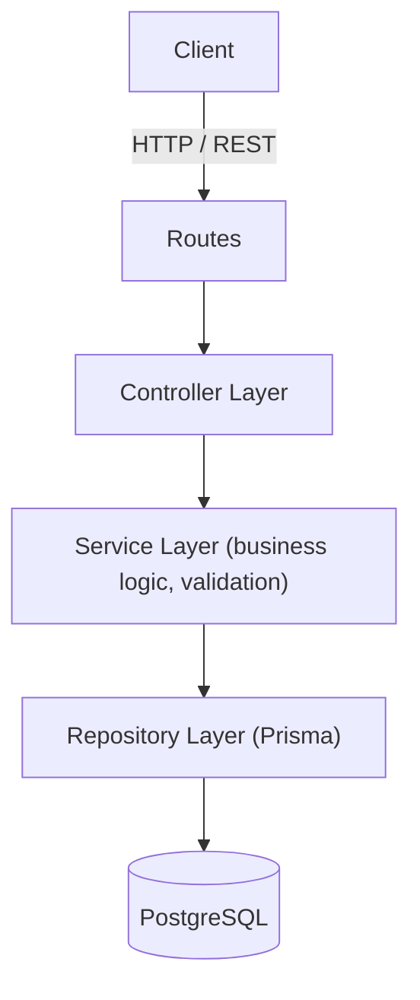
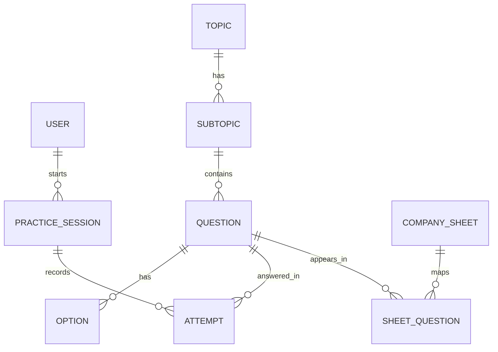
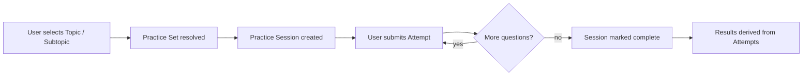

# Ascend

Ascend is a backend-focused aptitude preparation platform for placement and interview preparation. It models the practice workflow a candidate actually goes through — from browsing topics down to reviewing performance — as a relational domain, and exposes it through a layered REST API.

> **Status:** Functional backend implementing the core practice workflow, content management, and performance aggregation. Infrastructure concerns such as caching, background jobs, and containerization are not part of the current implementation.

## Table of Contents

1. [What is Ascend?](#1-what-is-leetaptitude)
2. [Core Workflow](#2-core-workflow)
3. [Current Implementation Status](#3-current-implementation-status)
4. [Core Features](#4-core-features)
5. [Architecture](#5-architecture)
6. [Request Flow](#6-request-flow)
7. [Domain Model](#7-domain-model)
8. [Database Schema](#8-database-schema)
9. [Practice Session & Attempt Workflow](#9-practice-session--attempt-workflow)
10. [Performance Aggregation](#10-performance-aggregation)
11. [Company Sheets](#11-company-sheets)
12. [API Overview](#12-api-overview)
13. [Backend Engineering Decisions](#13-backend-engineering-decisions)
14. [Validation and Transactions](#14-validation-and-transactions)
15. [Security](#15-security)
16. [Project Structure](#16-project-structure)
17. [Running Locally](#17-running-locally)
18. [Current Limitations](#18-current-limitations)
19. [Closing](#19-closing)

---

## 1. What is Ascend?

Ascend organizes aptitude and placement-prep content into a topic hierarchy, lets users practice against structured question sets, and tracks their attempts so performance can be derived rather than manually recorded.

```
Topic → Subtopic → Practice Set → Practice Session → Attempts → Results / Progress
```

The system is built as a **backend engineering project first**: the emphasis is on REST API design, relational data modeling, layered architecture, validation, and correctness of multi-step writes — not on UI or content volume.

## 2. Core Workflow

```
Topic
  │
  ▼
Subtopic
  │
  ▼
Practice Set (Questions + Options)
  │
  ▼
Practice Session
  │
  ▼
Attempts
  │
  ▼
Results / Progress
```

A user selects a topic, narrows into a subtopic, and practices against a set of questions within a session. Each answer is recorded as an attempt, and a user's performance is derived by walking the relationship chain from attempt back up through question → subtopic → topic — it is not stored as a separate, independently-maintained summary.

## 3. Current Implementation Status

| Area | Status |
| --- | --- |
| User accounts | Implemented |
| Topic management | Implemented |
| Subtopic management | Implemented |
| Question & option management | Implemented |
| Practice sessions | Implemented |
| Attempts | Implemented |
| Profile / performance aggregation | Implemented |
| Admin content management | Implemented |
| Company sheets & question mapping | Implemented |
| Prisma transactions (sheet creation) | Implemented |
| Service-layer validation | Implemented |
| Redis / caching | Not implemented |
| Rate limiting | Not implemented |
| Background jobs / queues | Not implemented |
| AI features | Not implemented |
| Docker | Not implemented |
| Real-time features | Not implemented |
| Automated testing | Not implemented |

Only the items marked **Implemented** above should be treated as existing functionality anywhere else in this document.

## 4. Core Features

### Content (Admin)

- Create, update, and manage topics and subtopics
- Create, update, and manage questions and their options
- Create company-specific practice sheets
- Map questions to company sheets

### Practice (User)

- Browse topics and subtopics
- Start a practice session against a practice set
- Submit attempts for questions within a session
- View session results
- View aggregated performance across topics and subtopics
- Browse and practice from company-specific sheets

## 5. Architecture



Ascend uses a **layered Controller → Service → Repository architecture**:

- **Controller** — parses the HTTP request and delegates to the service layer; contains no business logic.
- **Service** — owns business logic, validation, and orchestration of multi-step operations (including transactions).
- **Repository** — the only layer that talks to the database, via Prisma.

This keeps validation and business rules out of the controllers and out of raw database access, so each layer has one responsibility.

## 6. Request Flow

```
Client
  │
  ▼
Route
  │
  ▼
Controller
  │
  ▼
Service (validation, business logic)
  │
  ▼
Repository (Prisma)
  │
  ▼
PostgreSQL
  │
  ▼
Response
```

## 7. Domain Model



| Entity | Represents |
| --- | --- |
| **User** | An account practicing on the platform |
| **Topic** | A top-level subject area (e.g. Quantitative Aptitude) |
| **Subtopic** | A narrower category within a topic |
| **Question** | A single aptitude question belonging to a subtopic |
| **Option** | An answer choice belonging to a question |
| **PracticeSession** | A user's practice run against a set of questions |
| **Attempt** | A user's answer to one question within a session |
| **CompanySheet** | A curated, company-specific set of questions |
| **SheetQuestion** | The mapping between a company sheet and its questions |

## 8. Database Schema

Ascend uses **PostgreSQL** with **Prisma** as the ORM.

```
User
 ├── id
 ├── name
 ├── email
 └── password

Topic
 ├── id
 └── name

Subtopic
 ├── id
 ├── topicId ───────────► Topic
 └── name

Question
 ├── id
 ├── subtopicId ────────► Subtopic
 ├── text
 └── difficulty

Option
 ├── id
 ├── questionId ────────► Question
 ├── text
 └── isCorrect

PracticeSession
 ├── id
 ├── userId ────────────► User
 ├── startedAt
 └── status

Attempt
 ├── id
 ├── sessionId ─────────► PracticeSession
 ├── questionId ────────► Question
 ├── selectedOptionId
 └── isCorrect

CompanySheet
 ├── id
 └── companyName

SheetQuestion
 ├── id
 ├── sheetId ───────────► CompanySheet
 └── questionId ────────► Question
```

> Replace this block with the exact contents of `schema.prisma` so the README stays in sync with the actual database.

## 9. Practice Session & Attempt Workflow



A practice session is created against a resolved set of questions. Each answer the user submits is persisted as an `Attempt`, linked to both the session and the question. Whether an attempt is correct is derived by comparing the selected option against the question's correct option. Results are read from the attempts belonging to a session rather than recomputed and stored separately.

## 10. Performance Aggregation

User performance is **derived**, not pre-computed and stored:

```
Attempt → Question → Subtopic → Topic
```

To produce a performance view (e.g. accuracy per topic, or per subtopic), the service layer walks this relationship chain — grouping a user's attempts by the subtopic and topic their underlying questions belong to. This keeps performance data always consistent with the underlying attempts, at the cost of computing it on read rather than maintaining a separate running total.

## 11. Company Sheets

A company sheet is a curated set of questions, connected to questions through a mapping table (`SheetQuestion`) rather than a direct list on the sheet itself — mirroring how questions can belong to more than one sheet and how sheet membership is tracked independently of the question's subtopic.

Creating a sheet along with its initial question mappings is done as a single Prisma transaction, so a sheet is never left persisted without its mapped questions if a step in the creation fails partway through.

## 12. API Overview

| Module | Responsibility |
| --- | --- |
| Topics | Topic CRUD |
| Subtopics | Subtopic CRUD |
| Questions | Question & option CRUD |
| Practice Sessions | Session lifecycle |
| Attempts | Recording answers |
| Performance | Aggregated user performance |
| Company Sheets | Sheet and question-mapping management |

Representative endpoints (verify exact routes against the codebase before publishing):

### Topics & Subtopics

```http
GET    /api/v1/topics
GET    /api/v1/topics/:id
POST   /api/v1/topics
PATCH  /api/v1/topics/:id

GET    /api/v1/topics/:id/subtopics
POST   /api/v1/subtopics
PATCH  /api/v1/subtopics/:id
```

### Questions

```http
GET    /api/v1/subtopics/:id/questions
POST   /api/v1/questions
PATCH  /api/v1/questions/:id
DELETE /api/v1/questions/:id
```

### Practice Sessions & Attempts

```http
POST   /api/v1/practice-sessions
GET    /api/v1/practice-sessions/:id
POST   /api/v1/practice-sessions/:id/attempts
GET    /api/v1/practice-sessions/:id/results
```

### Performance

```http
GET    /api/v1/users/me/performance
GET    /api/v1/users/me/performance/topics/:topicId
```

### Company Sheets

```http
GET    /api/v1/company-sheets
POST   /api/v1/company-sheets
GET    /api/v1/company-sheets/:id/questions
POST   /api/v1/company-sheets/:id/questions
```

## 13. Backend Engineering Decisions

| Decision | Reason |
| --- | --- |
| Layered Controller → Service → Repository | Separates request handling, business logic, and data access |
| PostgreSQL | Relational domain with clear entity relationships |
| Prisma | Type-safe database access and schema management |
| Service-layer validation | Keeps validation rules out of controllers and repositories |
| Prisma transactions for sheet + mapping creation | Prevents a company sheet from being persisted without its question mappings |
| Derived performance aggregation | Keeps performance data consistent with attempts without maintaining a separate summary table |
| Mapping table for sheet ↔ question | Allows a question to belong to multiple company sheets |

## 14. Validation and Transactions

- Request-level validation (required fields, types, ranges) is enforced in the **service layer**, before any database write.
- Multi-step writes that must succeed or fail together — most notably creating a company sheet along with its initial question mappings — are wrapped in a **Prisma transaction**.
- Other single-entity writes (creating a topic, updating a question) are not currently transactional, since they involve only one table.

## 15. Security

| Mechanism | Status |
| --- | --- |
| Password hashing | Implemented |
| Authenticated routes | Implemented |
| Service-layer input validation | Implemented |
| Rate limiting | Not implemented |
| Advanced authorization/RBAC | Unclear — confirm against actual admin-route guards |

> Update this table to reflect the actual auth mechanism (session vs JWT, cookie handling, etc.) used in the codebase.

## 16. Project Structure

```
leetaptitude/
│
├── src/
│   ├── controllers/
│   ├── services/
│   ├── repositories/
│   ├── routes/
│   ├── validators/
│   └── middleware/
│
├── prisma/
│   ├── schema.prisma
│   └── migrations/
│
├── package.json
└── README.md
```

> Replace with the actual repository layout before publishing.

## 17. Running Locally

```bash
git clone <repository-url>
cd leetaptitude

npm install

# configure environment
cp .env.example .env

# run database migrations
npx prisma migrate dev

# start development server
npm run dev
```

> Replace with the actual scripts defined in `package.json` if they differ.

## 18. Current Limitations

### Current limitations

- No caching layer — every read hits PostgreSQL directly.
- No rate limiting on write-heavy or auth endpoints.
- Automated test coverage is not yet in place.
- Performance aggregation is computed on read, with no indexing/optimization work done for large attempt volumes.

### Not currently required

Intentionally out of scope for the current stage:

- Redis / caching
- Background job queues
- AI-based features
- Docker / containerization
- Real-time features (websockets, live leaderboards)

## 19. Closing

Ascend is a backend-focused practice-platform project centered on relational data modeling, layered service architecture, and correct handling of multi-step writes — from topic hierarchies down to individual attempts and derived performance. Infrastructure and AI features are explicitly out of scope for the current version rather than partially built.
